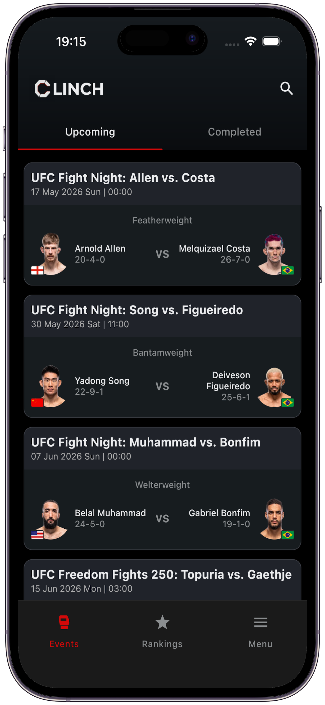
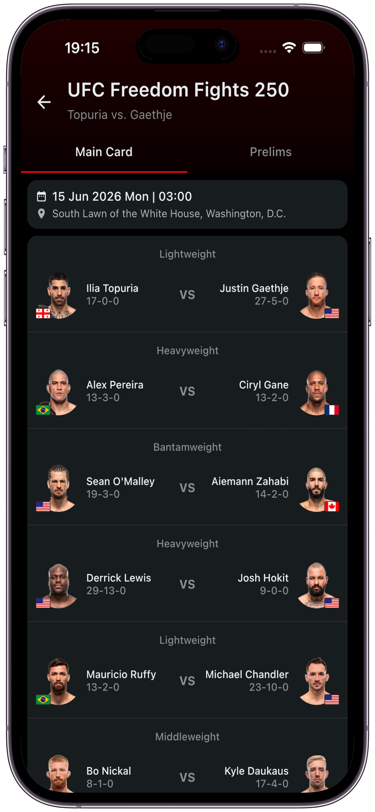
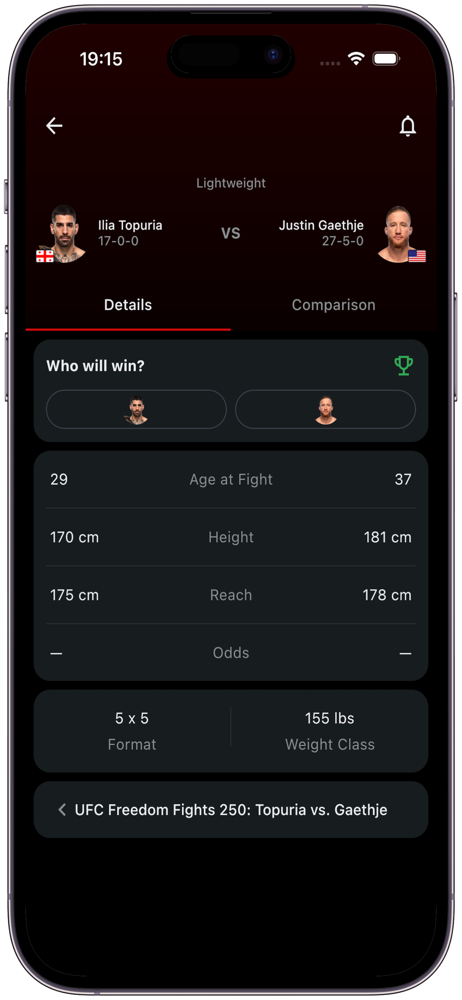
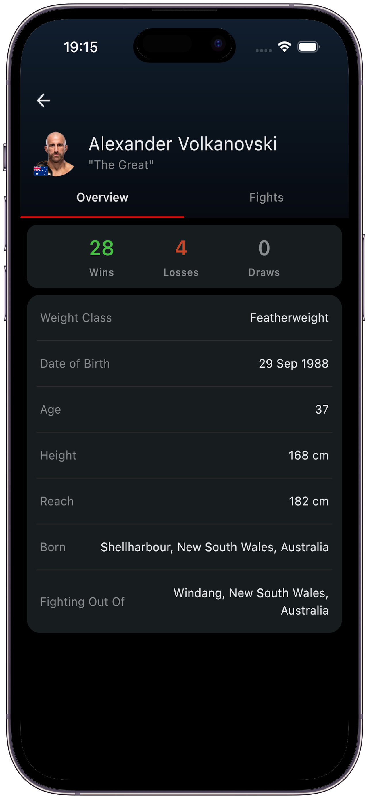

# 🥊 Clinch - MMA Statistics & Event Tracker

A modern, cross-platform Mixed Martial Arts application built with **Kotlin Multiplatform (KMP)** for Android and iOS. Stay up to date with the latest MMA events, analyze fight statistics, create predictions, and compete on the global leaderboard!

 

## 📲 Download

## ✨ Key Features

* **Cross-Platform Experience:** Built natively for both Android and iOS, sharing business logic and UI components via Compose Multiplatform.
* **Events & Detailed Stats:** Track upcoming and past MMA events, explore fight cards, and check detailed fighter statistics, fight histories, and radar chart comparisons.
* **Fight Predictions:** Predict the outcome of fights before they happen! Earn points based on real odds.
* **Leaderboard:** Compete with other MMA fans. Check out other users' profiles to see their prediction history and favorite fighters.
* **Personalized Profiles:** Build your own custom MMA identity. Curate your "Goat List", "Favorite Fighters", and "Hated Fighters".
* **Real-time Notifications:** Get notified before your tracked fights start and exactly when the results are announced.
* **Adaptive Theme & Localization:** Seamless Light and Dark mode support that adapts to your OS settings, fully localized in English and Turkish.

## 📱 Screenshots

  
  
  
  

## 🛠️ Tech Stack

* **UI Framework:** Jetpack Compose & Compose Multiplatform
* **Architecture:** Clean Architecture (MVVM/MVI pattern)
* **Local Database:** Room Database (KMP implementation)
* **Backend & Authentication:** Supabase (PostgreSQL, Auth)
* **Dependency Injection:** Koin
* **Asynchronous Operations:** Kotlin Coroutines & Flows
* **Image Loading:** Coil 3
* **Networking:** Ktor

## 📬 Contact

Please contact us with any questions, support requests, or feedback: **[clinchapp0@gmail.com](mailto:clinchapp0@gmail.com)**
